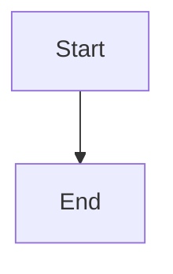

# CLAUDE.md

This file provides guidance to Claude Code (claude.ai/code) when working with code in this repository.

## Project Overview

Next.js 15 blog template with App Router, React Server Components, and Contentlayer2 for MDX content management. Uses Bun as runtime and package manager.

## Development Commands

```bash
bun dev              # Start development server
bun run build        # Build for production
bun run start        # Start production server
bun run lint         # Lint and auto-fix code
```

## Content Frontmatter

### Blog Post Fields

| Field          | Type    | Required | Description                          |
| -------------- | ------- | -------- | ------------------------------------ |
| `title`        | string  | ✅       | Post title                           |
| `date`         | date    | ✅       | Publication date                     |
| `tags`         | list    | -        | Array of tags                        |
| `lastmod`      | date    | -        | Last modified date                   |
| `draft`        | boolean | -        | Draft status, hidden in production   |
| `summary`      | string  | -        | Post summary                         |
| `images`       | json    | -        | Cover image array                    |
| `authors`      | list    | -        | Author list                          |
| `layout`       | string  | -        | Layout type                          |
| `bibliography` | string  | -        | Bibliography file path               |
| `canonicalUrl` | string  | -        | Canonical URL for SEO                |
| `series`       | string  | -        | Series name for roadmap              |
| `step`         | number  | -        | Step number in series (for ordering) |
| `deprecated`   | boolean | -        | Mark post as deprecated/outdated     |

### Example

```yaml
---
title: My Post Title
date: 2025-12-25
tags: [AI, Coding]
lastmod: 2025-12-26
draft: false
summary: This is a sample post
images: ['/static/images/cover.jpg']
authors: ['default']
layout: PostLayout
---
```

## Draft Feature

Set `draft: true` in frontmatter to mark a post as draft:

```yaml
---
title: Draft Article
date: 2025-12-25
draft: true
---
```

- **Development** (`bun dev`): Drafts are visible
- **Production** (`bun run build`): Drafts are automatically excluded

## Series Posts with Roadmap

### Series Frontmatter

Use `series` and `step` fields to organize series posts with an immersive roadmap:

```yaml
---
title: Part 1 - Introduction
date: 2025-12-25
series: My Series Name
step: 1
summary: First part of the series
---
```

### Nested Routing Alternative

You can also organize series posts using nested folders:

```
data/blog/
└── my-series/
    ├── part-1-intro.mdx      # /blog/my-series/part-1-intro
    ├── part-2-deep-dive.mdx  # /blog/my-series/part-2-deep-dive
    └── part-3-conclusion.mdx # /blog/my-series/part-3-conclusion
```

Posts in the same folder are sorted by date automatically.

### Series Roadmap Component

When a post has the `series` frontmatter, a "View Series Roadmap" button appears. Clicking opens an immersive full-screen roadmap featuring:

- **Animated beam path** with gradient (blue → violet → pink)
- **Staggered node layout** alternating above/below center
- **Progress indicators** (✓ for completed, pulse for current)
- **Info cards** on hover with post details
- **Framer Motion animations** with smooth transitions
- **Body scroll lock** to prevent background scrolling

The roadmap is built with `SeriesRoadmap` component at `components/SeriesRoadmap.tsx`.

## Architecture

### Content Management with Contentlayer2

Content managed through Contentlayer2 with schemas in `contentlayer.config.ts`. Posts stored as MDX files in `data/blog/` and processed into TypeScript types in `.contentlayer/generated/`.

**Content sources:**

- Blog posts: `data/blog/**/*.mdx` (organized by locale: `en/`, `zh/`)
- Author profiles: `data/authors/**/*.mdx`

**Processing pipeline:**

- Remark: frontmatter, GFM, code titles, math (KaTeX), image-to-JSX, GitHub alerts
- Rehype: heading slugs, autolink, KaTeX, citations, Prism syntax highlighting

### Next.js App Router Structure

All pages in `app/[locale]/` directory for i18n support:

- Dynamic routes: `app/[locale]/blog/[...slug]/page.tsx` (catch-all for nested routes)
- Tag pages: `app/[locale]/tags/[tag]/page/[page]/page.tsx`
- Static generation via `generateStaticParams()`
- Draft posts excluded in production when `draft: true`
- Locale prefixes: `/zh/...`, `/en/...`

### Layout System

Layouts defined by `layout` frontmatter field:

- `PostLayout`: Default 2-column layout with sidebar
- `PostSimple`: Single-column simplified layout
- `PostBanner`: Full-width with banner image

### Site Configuration

All site configuration in `data/siteMetadata.js`:

- Basic metadata (title, author, description)
- Social links (GitHub, Twitter/X, LinkedIn, etc.)
- Analytics (Umami, Plausible, PostHog, Google Analytics)
- Comments (Giscus, Utterances, Disqus)
- Newsletter (Mailchimp, Buttondown, ConvertKit, etc.)
- Search (Kbar or Algolia)

## Directory Structure

```
├── app/                    # Next.js App Router pages
│   └── [locale]/          # Locale-based routing (en/zh)
├── components/            # React components
│   ├── SeriesRoadmap.tsx # Series roadmap with Framer Motion
│   ├── LanguageSwitch.tsx # i18n language toggle
│   ├── HeroTypewriter.tsx # Typewriter effect
│   ├── Mermaid.tsx       # Mermaid chart renderer
│   ├── MermaidLoader.tsx # Dynamic Mermaid loader
│   └── MobileNav.tsx     # Mobile nav with scroll lock
├── src/
│   └── navigation.ts     # next-intl routing config
├── contentlayer.config.ts # Contentlayer configuration
├── css/tailwind.css       # Tailwind CSS v4 config
├── data/
│   ├── blog/             # Posts (en/, zh/)
│   ├── authors/          # Author configurations
│   ├── siteMetadata.js   # Site metadata
│   └── projectsData.ts   # Projects data
└── public/               # Static assets
```

## Important Notes

### Turbopack Compatibility

**Next.js 16+ is NOT compatible with Contentlayer2.** Next.js 16 uses Turbopack by default, which does not support `next-contentlayer2`.

The project uses Next.js 15.x to maintain webpack support for Contentlayer2.

### Search Path Configuration

Kbar search index is generated at `public/search.json`. The path is configured in `data/siteMetadata.js`:

```js
search: {
  provider: 'kbar',
  kbarConfig: {
    searchDocumentsPath: 'search.json', // Relative to public/
  },
}
```

## New Features

### next-intl i18n

Full internationalization support using `next-intl`:

**Configuration** (`src/navigation.ts`):

- Supported locales: `en`, `zh`
- Default locale: `zh`
- Locale prefix: `always` (e.g., `/zh/blog`, `/en/blog`)

**Language Switch Component** (`components/LanguageSwitch.tsx`):

- Toggle between Chinese (中) and English (En)
- Animated sliding pill indicator
- Integrated into Header

**Content Structure**:

- Posts organized by locale: `data/blog/en/**/*.mdx`, `data/blog/zh/**/*.mdx`
- Locale extracted as computed field in Contentlayer
- Routing handled via `app/[locale]/` directory structure

### Mermaid Charts

Mermaid diagram support for flowcharts, sequence diagrams, and more.

**Components**:

- `components/Mermaid.tsx` - Main Mermaid renderer with dark theme support
- `components/MermaidLoader.tsx` - Dynamic loader for layouts

**Usage in MDX**:

````markdown

````

````

**Layout Support**:
- `PostLayout` and `PostSimple`: Built-in Mermaid support
- `PostBanner`: Requires `MermaidLoader` component

**Styling**: Charts centered with `flex justify-center` class.

### Hero Typewriter Effect

Animated typewriter effect for homepage descriptions.

**Component** (`components/HeroTypewriter.tsx`):
- Cycles through multiple description strings
- Smooth typing/deleting animation
- Blinking cursor effect
- Custom typing speeds (100ms typing, 50ms deleting, 2000ms pause)

**Configuration** (`data/siteMetadata.js`):
```js
descriptions: [
  '写作即思考 - A blog about technology and thinking',
  '编程即创造 - Coding is creating',
  '分享即学习 - Sharing is learning',
]
````

### Deprecated Posts

Mark posts as outdated/deprecated with visual indicators:

**Component** (`components/DeprecatedBadge.tsx`):

- Amber-colored badge with warning icon
- i18n support: "已过时" (zh) / "Deprecated" (en)
- Optional warning text for article pages
- Dark mode support
- Responsive design

**Usage** (`data/blog/**/*.mdx`):

```yaml
---
title: Legacy Article
date: 2023-01-01
deprecated: true
---
```

**Display Locations**:

- **List pages**: Badge next to post title
- **Article pages**: Warning banner below title with explanatory text

### Mobile Navigation

Enhanced mobile nav with body scroll lock:

**Component** (`components/MobileNav.tsx`):

- Uses `body-scroll-lock` for preventing background scroll
- Smooth transitions with Headless UI
- Internationalized nav links via `next-intl`
- Z-index layering (modal: z-60, panel: z-70, close button: z-80)
