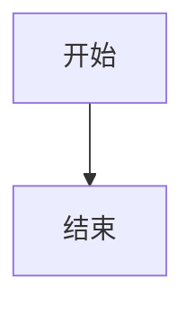

# 写作即思考

基于 Next.js 15 + Contentlayer2 + Tailwind CSS v4 的博客模板。

## 功能特性

- **React Server Components** - 使用 Next.js App Router
- **MDX 内容管理** - 通过 Contentlayer2 管理 Markdown 内容
- **国际化支持** - 中英文文章目录 (`data/blog/en/`, `data/blog/zh/`)
- **语法高亮** - 支持行号和行高亮
- **数学公式** - KaTeX 支持
- **引用文献** - Citation 和 bibliography 支持
- **GitHub Alerts** - 支持 `> [!NOTE]`, `> [!WARNING]` 等
- **Mermaid 图表** - 支持流程图、时序图等
- **标签系统** - 自动生成标签页面
- **多作者支持** - 可配置多个作者
- **多种布局** - PostLayout, PostSimple, PostBanner
- **系列文章路线图** - 沉浸式系列导航
- **过时文章标记** - 提示文章已过时

## Frontmatter 字段

### 文章字段

| 字段           | 类型    | 必填 | 说明               |
| -------------- | ------- | ---- | ------------------ |
| `title`        | string  | ✅   | 文章标题           |
| `date`         | date    | ✅   | 发布日期           |
| `tags`         | list    | -    | 标签数组           |
| `lastmod`      | date    | -    | 最后修改日期       |
| `draft`        | boolean | -    | 草稿，生产环境隐藏 |
| `summary`      | string  | -    | 文章摘要           |
| `images`       | json    | -    | 封面图数组         |
| `authors`      | list    | -    | 作者列表           |
| `layout`       | string  | -    | 布局类型           |
| `bibliography` | string  | -    | 引用文件路径       |
| `canonicalUrl` | string  | -    | 规范链接           |
| `series`       | string  | -    | 系列名称           |
| `step`         | number  | -    | 系列步骤序号       |
| `deprecated`   | boolean | -    | 标记为过时文章     |

### 示例

```yaml
---
title: 我的文章标题
date: 2025-12-25
tags: [AI, 编程]
lastmod: 2025-12-26
draft: false
summary: 这是一篇示例文章
images: ['/static/images/cover.jpg']
authors: ['default']
layout: PostLayout
---
```

## Draft（草稿）功能

设置 `draft: true` 可将文章标记为草稿：

```yaml
---
title: 草稿文章
date: 2025-12-25
draft: true
---
草稿内容...
```

- **开发环境** (`bun dev`)：草稿可见
- **生产环境** (`bun run build`)：草稿自动隐藏

## 系列文章

### 方法一：frontmatter 方式

使用 `series` 和 `step` 字段组织系列文章：

```yaml
---
title: 第一部分 - 简介
date: 2025-12-25
series: 我的系列
step: 1
summary: 系列的第一部分
---
```

开启后文章会显示"查看系列路线图"按钮，点击可打开沉浸式路线图：

- 动画光束路径（蓝 → 紫 → 粉）
- 交错节点布局
- 进度指示器（✓ 完成，脉冲 当前）
- 悬停显示文章信息卡片

### 方法二：嵌套路由

通过嵌套文件夹组织系列文章：

```
data/blog/
└── my-series/
    ├── part-1-intro.mdx      # /blog/my-series/part-1-intro
    ├── part-2-deep-dive.mdx  # /blog/my-series/part-2-deep-dive
    └── part-3-conclusion.mdx # /blog/my-series/part-3-conclusion
```

同一文件夹下的文章按日期自动排序。

## Mermaid 图表

支持在文章中使用 Mermaid 绘制流程图、时序图等：

````markdown

````

支持的图表类型：

- Flowcharts（流程图）
- Sequence Diagrams（时序图）
- State Diagrams（状态图）
- Class Diagrams（类图）
- Entity-Relationship Diagrams（ER 图）
- User Journey（用户旅程）
- Gantt（甘特图）

## 过时文章标记

设置 `deprecated: true` 可标记文章为过时：

```yaml
---
title: 旧文章
date: 2023-01-01
deprecated: true
---
```

- 列表页：标题旁显示黄色警告徽章
- 文章页：标题下方显示警告横幅

## 目录结构

```
├── app/                    # Next.js App Router 页面
│   └── [locale]/          # 国际化路由 (en/zh)
├── components/            # React 组件
│   ├── SeriesRoadmap.tsx # 系列路线图
│   ├── LanguageSwitch.tsx # 语言切换
│   ├── HeroTypewriter.tsx # 首页打字机效果
│   ├── Mermaid.tsx       # Mermaid 渲染器
│   ├── MermaidLoader.tsx # 动态加载器
│   └── MobileNav.tsx     # 移动端导航
├── contentlayer.config.ts # Contentlayer 配置
├── css/tailwind.css       # Tailwind CSS v4 配置
├── data/
│   ├── blog/             # 文章 (en/, zh/)
│   ├── authors/          # 作者配置
│   ├── siteMetadata.js   # 站点配置
│   └── projectsData.ts   # 项目数据
├── src/
│   └── navigation.ts     # next-intl 路由配置
└── public/               # 静态资源
```

## 开发命令

```bash
bun dev              # 开发服务器
bun run build        # 生产构建
bun run start        # 启动生产服务器
bun run lint         # 代码检查
```
