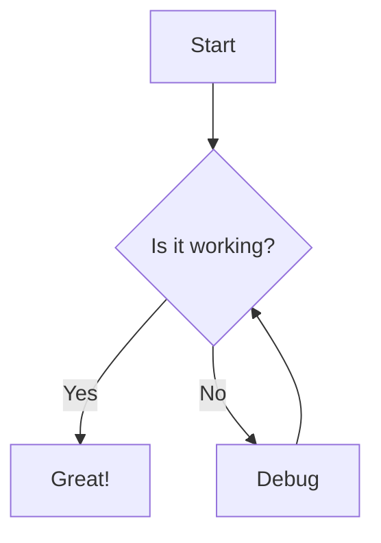
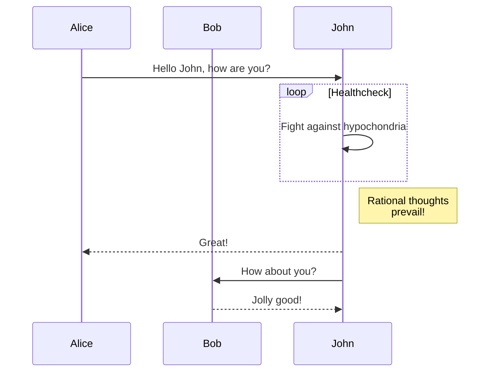
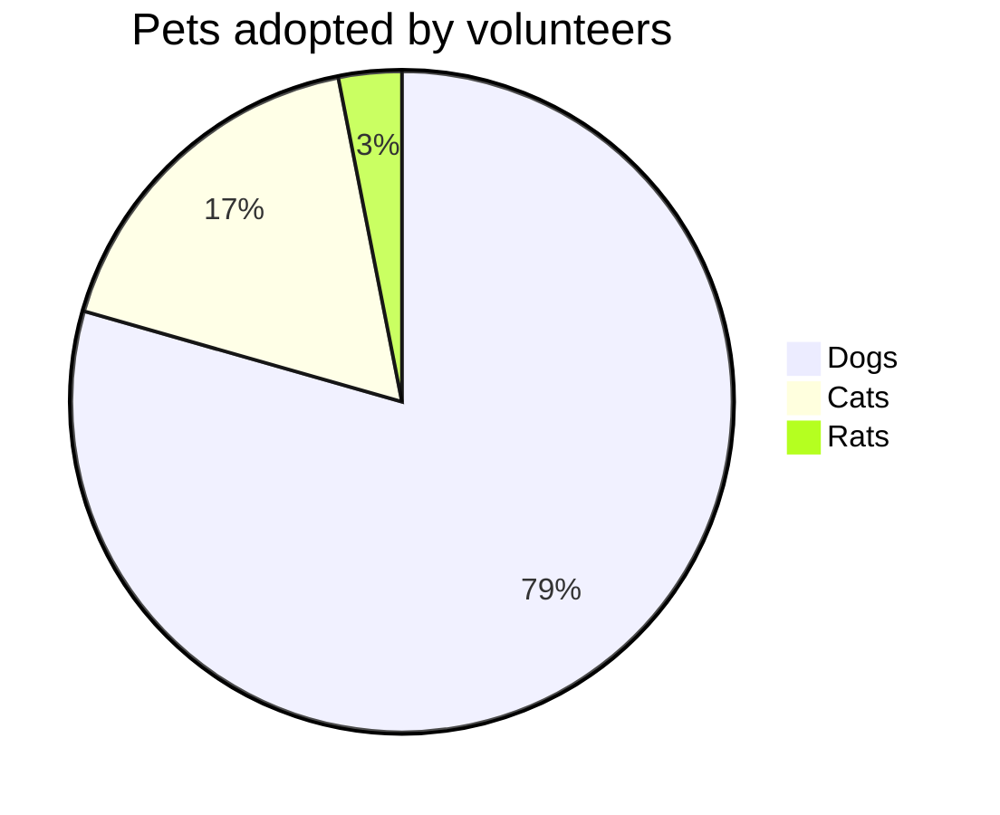

## Introduction

We have added support for [Mermaid](https://mermaid.js.org/) diagrams in MDX files. This allows you to create diagrams and visualizations using text and code.

## Usage

To add a Mermaid diagram, simply use a code block with the language set to `mermaid`.

### Flowchart



**Code:**

````markdown

````

### Sequence Diagram



**Code:**

````markdown

````

### Pie Chart



**Code:**

````markdown

````
