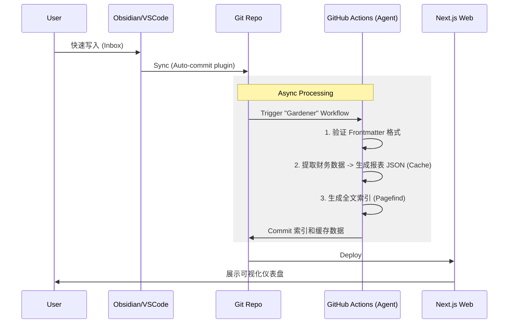

## Claude Code 接入非官方模型教程




### 开始之前：你真的需要这些配置吗？

从**第一性原理**思考：使用工具的目的是**创造价值**。

Claude Code 官网可直接使用，开箱即用。对于大多数个人开发者来说，这完全够用。

| 判断条件           | 官网直接用  | 多模型配置  |
| ------------------ | ----------- | ----------- |
| 追求开箱即用       | ✅ 推荐     | ❌ 过度折腾 |
| 成本不敏感         | ✅ 够用     | 可选        |
| 频率不高           | ✅ 完全够用 | 没必要      |
| 频繁使用、成本敏感 | 可考虑      | ✅ 适合     |
| 需要备选方案       | 可考虑      | ✅ 适合     |

**核心建议**：如果你官网额度够用、追求效率，直接用官网就好。折腾这些配置的时间，本可以用来创造价值。

多模型配置的本质是**用配置复杂度换取性价比**——值不值得，只有你自己能判断。

---

Claude Code 接入非官方模型（以智谱为例）存在三种主流方案，经对比后本教程选择第二种方案开展配置，具体方案说明如下：

- 第一种方案：采用官网推荐方式（参考 https://docs.bigmodel.cn/cn/coding-plan/tool/claude），通过直接替换环境变量实现接入。

- 第二种方案：本教程采用的方案，即通过新建项目目录、配置可执行脚本目录及创建调用脚本的方式实现接入。

- 第三种方案：使用 claude-code-router 工具（参考 项目初始化及原理文档）。该方案实现逻辑过于复杂，且模型切换操作繁琐，使用成本较高。

方案对比结论：第二种方案在实现难度、使用便捷性与稳定性之间取得了良好平衡，既避免了复杂的工具配置，又能实现非官方模型与原生 Claude 模型的独立调用，互不干扰，因此作为本次接入的优选方案。

#### 一、三步配置流程

1. 新建项目目录并安装依赖

```bash
# 新建目录并进入
mkdir ~/claude-model && cd ~/claude-model
# 初始化项目
bun init -y
# 安装 Claude Code
bun add @anthropic-ai/claude-code
# 新建claude-code配置/缓存目录
mkdir .claude-glm
```

2. 配置可执行脚本目录（添加到系统PATH）

```bash
# 新建bin目录
mkdir ~/claude-model/bin
# 配置PATH（根据系统修改对应文件）
# macOS：编辑 ~/.zshrc，Linux：编辑 ~/.bashrc
export PATH="$HOME/claude-model/bin:$PATH"
# 重启终端生效
```

3. 创建并配置调用脚本

- 新建脚本文件：`touch ~/claude-model/bin/claude-glm`
- 脚本内容（替换`YOUR_glm_API_KEY`为实际密钥）：

```bash

#!/usr/bin/env bash
CLAUDE_BIN="$HOME/claude-model/node_modules/.bin/claude"
# 注入API凭证
export ANTHROPIC_AUTH_TOKEN="YOUR_glm_API_KEY"
export ANTHROPIC_BASE_URL="https://ark.cn-beijing.volces.com/api/compatible"
export ANTHROPIC_MODEL="glm-seed-code-preview-latest"
export API_TIMEOUT_MS=3000000
# 独立配置目录（可选）
export CLAUDE_CONFIG_DIR="$HOME/claude-model/.claude-glm"
exec "$CLAUDE_BIN" "$@"
```

- 赋予执行权限：`chmod +x ~/claude-model/bin/claude-glm`

#### 三、使用与验证

- 验证安装：`claude-glm --version`（显示版本即成功，示例：2.0.76）
- 命令区分：
  - 调用 glm 版本 Claude Sonnet：`claude-glm`
  - 调用原始 Claude Sonnet 4.5：`claude`（互不影响）

#### 四、关键补充

- 模型优势：原生兼容 Anthropic API，无需调整。
- 价格套餐：写文时，约等于Claude Sonnet 4.5的编程能力。
- 扩展性：可按相同流程添加其他模型，每个模型对应独立调用命令。

#### 五、多模型扩展配置

使用相同方法添加更多模型，只需创建对应的调用脚本：

```bash
# 示例：添加 claude-minimax
cat > ~/claude-model/bin/claude-minimax << 'EOF'
#!/usr/bin/env bash
CLAUDE_BIN="$HOME/claude-model/node_modules/.bin/claude"
export ANTHROPIC_AUTH_TOKEN="YOUR_MINIMAX_API_KEY"
export ANTHROPIC_BASE_URL="https://api.minimax.chat/v1"
export ANTHROPIC_MODEL="minimax-model-name"
export API_TIMEOUT_MS=3000000
export CLAUDE_CONFIG_DIR="$HOME/.claude"  # 共享配置目录
exec "$CLAUDE_BIN" "$@"
EOF
chmod +x ~/claude-model/bin/claude-minimax

# 示例：添加 claude-deepseek
cat > ~/claude-model/bin/claude-deepseek << 'EOF'
#!/usr/bin/env bash
CLAUDE_BIN="$HOME/claude-model/node_modules/.bin/claude"
export ANTHROPIC_AUTH_TOKEN="YOUR_DEEPSEEK_API_KEY"
export ANTHROPIC_BASE_URL="https://api.deepseek.com/v1"
export ANTHROPIC_MODEL="deepseek-model-name"
export API_TIMEOUT_MS=3000000
export CLAUDE_CONFIG_DIR="$HOME/.claude"  # 共享配置目录
exec "$CLAUDE_BIN" "$@"
EOF
chmod +x ~/claude-model/bin/claude-deepseek

# 示例：添加 claude-mimo
cat > ~/claude-model/bin/claude-mimo << 'EOF'
#!/usr/bin/env bash
CLAUDE_BIN="$HOME/claude-model/node_modules/.bin/claude"
export ANTHROPIC_AUTH_TOKEN="YOUR_MIMO_API_KEY"
export ANTHROPIC_BASE_URL="https://api.mimo.com/v1"
export ANTHROPIC_MODEL="mimo-model-name"
export API_TIMEOUT_MS=3000000
export CLAUDE_CONFIG_DIR="$HOME/.claude"  # 共享配置目录
exec "$CLAUDE_BIN" "$@"
EOF
chmod +x ~/claude-model/bin/claude-mimo

# 示例：添加 claude-kimi（月之暗面）
cat > ~/claude-model/bin/claude-kimi << 'EOF'
#!/usr/bin/env bash
CLAUDE_BIN="$HOME/claude-model/node_modules/.bin/claude"
export ANTHROPIC_AUTH_TOKEN="YOUR_KIMI_API_KEY"
export ANTHROPIC_BASE_URL="https://api.moonshot.cn/v1"
export ANTHROPIC_MODEL="moonshot-v1-auto"
export API_TIMEOUT_MS=3000000
export CLAUDE_CONFIG_DIR="$HOME/.claude"  # 共享配置目录
exec "$CLAUDE_BIN" "$@"
EOF
chmod +x ~/claude-model/bin/claude-kimi
```

#### 六、MCP/Skill 配置复用方案

**问题**：每个独立实例的 MCP 服务器和 Skill 配置默认隔离，无法共享。

**解决方案**：将所有模型的 `CLAUDE_CONFIG_DIR` 指向同一目录（如原生 Claude 的配置目录 `~/.claude`）。

修改脚本中的配置行：

```bash
# 原本（独立配置）
export CLAUDE_CONFIG_DIR="$HOME/claude-model/.claude-glm"

# 修改为（共享配置）
export CLAUDE_CONFIG_DIR="$HOME/.claude"
```

**效果**：

- 所有模型实例共享同一套 MCP 服务器配置
- 所有模型实例共享同一套 Skill 配置
- 无需为每个模型单独配置扩展

**使用方式**：

```bash
# 所有命令共享相同的 MCP/Skill
claude              # 原生 Claude
claude-glm          # GLM 模型
claude-minimax      # MiniMax 模型
claude-deepseek     # DeepSeek 模型
claude-kimi         # Kimi 模型
claude-mimo         # Mimo 模型
```

#### 七、方案核心优势

**灵活性是最大的优势**：

这种多模型方案最核心的价值在于其灵活性：

1. **工具不会被付费限制** - 某个模型不付费了，随时切换到其他模型，工具本身依然可用
2. **使用习惯不被打断** - 所有模型使用相同的命令模式、相同的 MCP/Skill 配置，无需重新学习
3. **模型切换极其方便** - 一个命令就能切换模型，比如 `claude-kimi` 替代 `claude-glm`

本质上，这种方案将**工具选择**与**模型选择**解耦了：

- 工具（Claude Code）是稳定的
- 模型可以灵活组合、随时更换

这比那些"全家桶"式（工具和模型强绑定）的方案要自由得多。
